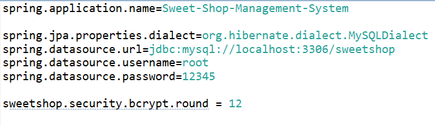
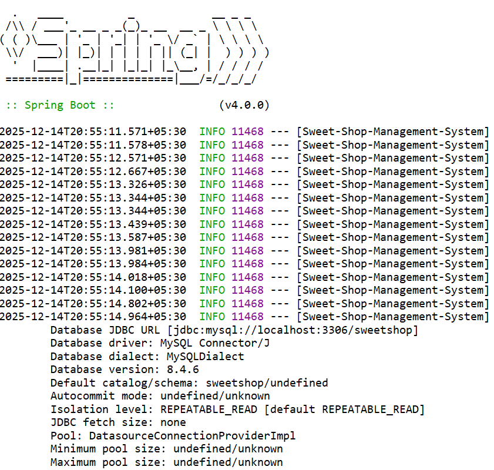

# 🍬 Sweet Shop Management System

This repository documentation covers **Backend** of the Sweet Shop Management System. Each section includes project explanation, local setup instructions, screenshot placeholders, and the mandatory **My AI Usage** section.

---

# 📗 Backend

## 📌 Project Overview
The **Sweet Shop Management System Backend** is responsible for handling business logic, data processing, and database operations. It exposes RESTful APIs that allow the frontend to manage sweets, inventory, and other shop-related operations.

The backend ensures secure data handling and serves as the core engine of the application.

---

## 🛠️ Tech Stack
- **Language:** Java
- **Framework:** Spring Boot
- **Database:** MySQL
- **Build Tool:** Maven

---

## ⚙️ Setup & Run Instructions (Backend)

### Prerequisites
Ensure the following are installed:
- Java JDK 17 or higher
- Maven
- DBMS (Recommended: MySQL)
- Git

### Clone the Repository
```bash
git clone https://github.com/HenishSoliya/Sweet-Shop-Management-System.git
cd Sweet-Shop-Management-System
```

### Setup Database
* Find the `Database.sql` file at root folder, it will help to setup the database.
* All the testing is done on the **mysql** database, so if possible use it.
* Every user who registers via the API or frontend is assigned the **"USER"** role by default. This role can be changed to **"ADMIN"** in the database for specific users with the help of SQL Query.

### Database Configuration
* Update database credentials in `Sweet-Shop-Management-System\src\main\resources\application.properties`


### Application.properties file Configuration
* Here, we can update the database dialect, url, username, and password as per the database.
* sweetshop.security.bcrypt.round is for bcrypt encoder and it is used for encrypt the password before store in database. (For high security high value required and minimum value is 12) 



### Build the Project
```bash
mvn clean install
```

### Run the Backend Server
```bash
mvn spring-boot:run
```

The backend server will run on: `http://localhost:8080`

---

## 🖼️ Screenshot of Backend is running


---

## 🤖 My AI Usage

### AI Tools Used
- **ChatGPT**

### How I Used Them
- Used ChatGPT to debug backend errors and configuration issues.
- For Spring Security I used ChatGPT to implement JWT Filter, JWT related services and security related configuration.
- Used ChatGPT for documentation guidance.

### Reflection on AI Impact
ChatGPT played an important role in accelerating backend development. It helped clarify complex concepts, reduced debugging time, and improved code quality. AI enhanced my learning experience and allowed me to focus more on application logic and design decisions.

---

## 🚀 Future Scope

The backend of the Sweet Shop Management System can be enhanced further with the following improvements:

* Advanced Inventory Management: Add low-stock alerts, automatic restocking suggestions, and expiry date tracking for sweets.
* Reporting & Analytics: Introduce detailed sales reports, daily/monthly revenue summaries, and analytics dashboards.
* Payment Integration: Integrate online payment gateways to support digital transactions.
* Cloud Deployment: Deploy the backend on cloud platforms like AWS or Azure with CI/CD pipelines.
* Audit & Logging: Implement centralized logging and audit trails for better monitoring and debugging.

## ✅ Final Notes
- Start the backend server before running the frontend
- Ensure API endpoints and ports match in frontend configuration
- Both projects are designed to run locally for development and testing

